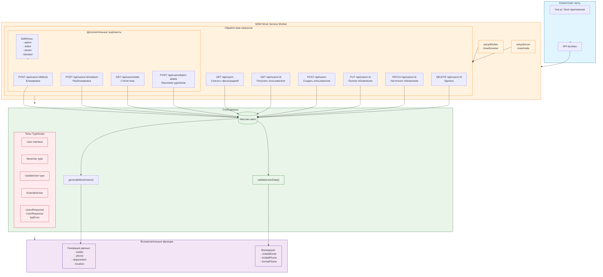
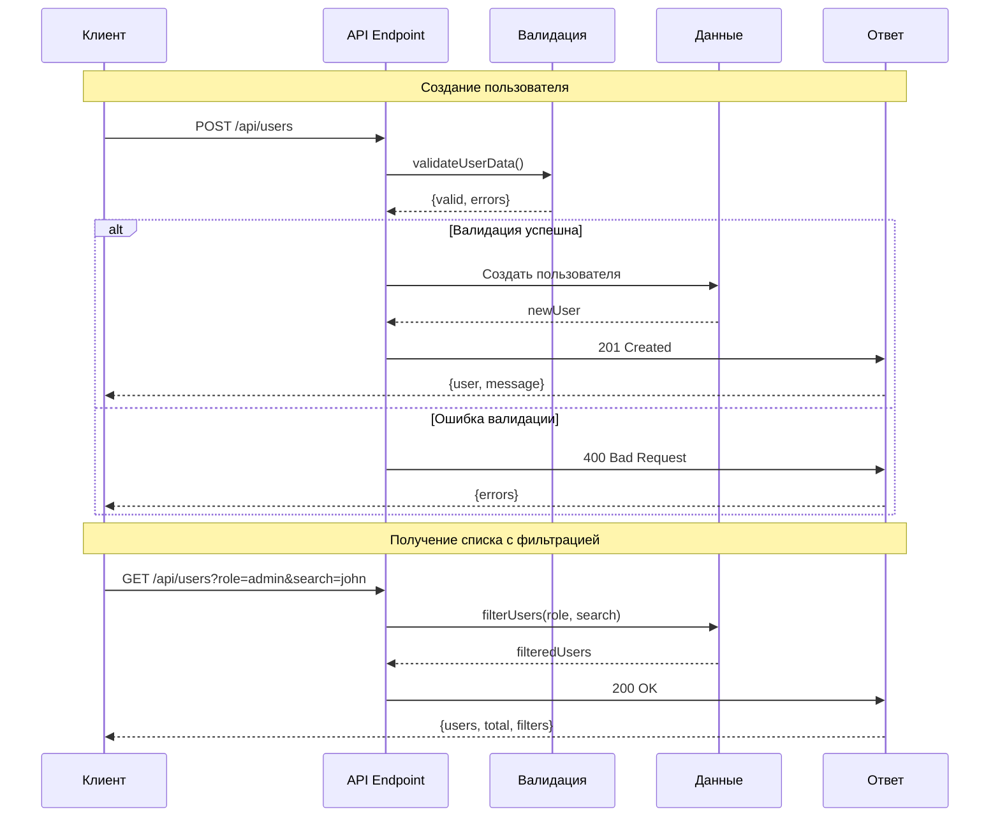
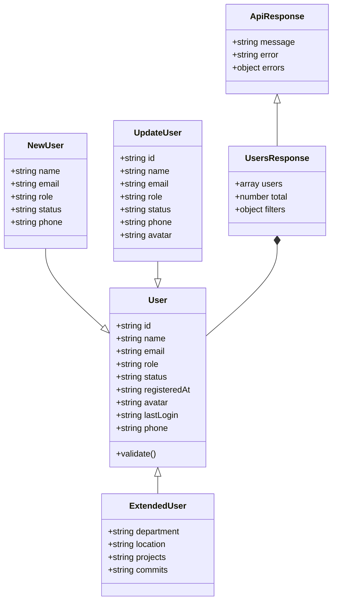
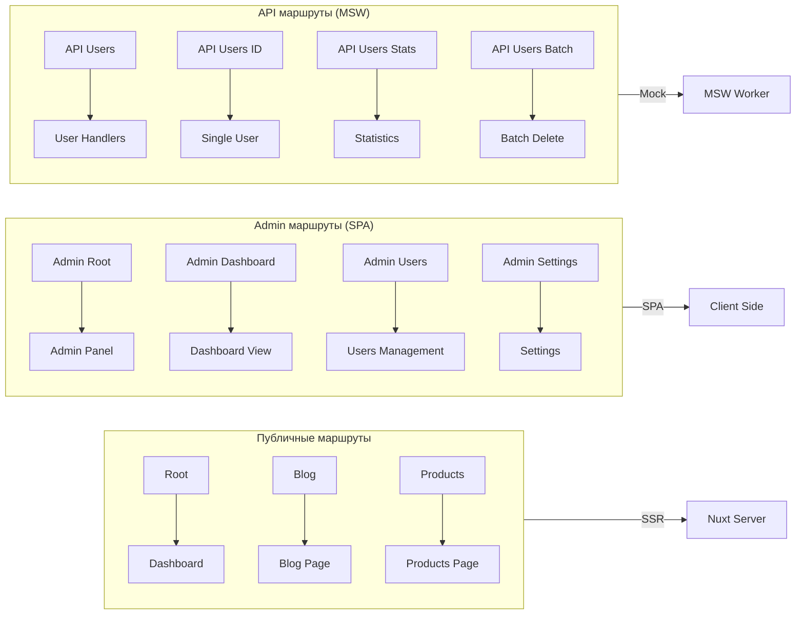

## Диаграмма потоков данных:

## Модель данных:

## Схема маршрутизации:

Эти диаграммы показывают:

1. **Архитектуру** - взаимодействие клиента с MSW и данными
2. **Потоки данных** - последовательность операций при запросах
3. **Модели данных** - структуру типов и их отношения
4. **Маршрутизацию** - как организованы публичные и admin маршруты
